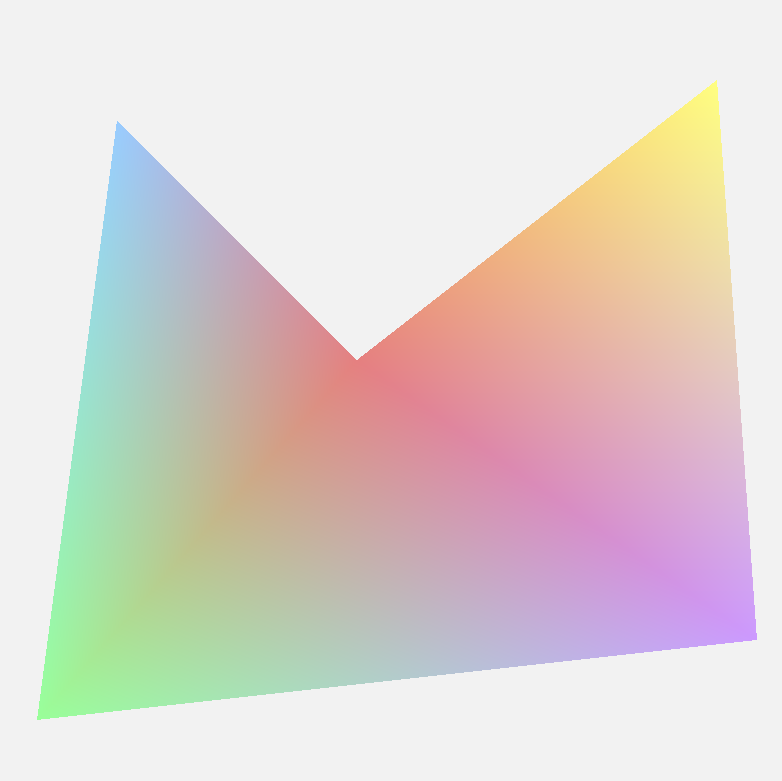

# Projeto Polígono

### O que era para ser feito?
  O objetivo deste projeto era criar uma aplicação gráfica capaz de renderizar um polígono complexo e não convexo. Para isso, foi necessário decompor a forma em múltiplos triângulos, definir as coordenadas e as cores de cada vértice e, por fim, especificar como esses vértices se conectam para formar a geometria desejada.

### Como foi feito?
A aplicação foi desenvolvida em **C++** utilizando a biblioteca **OpenGL** para a renderização. O arquivo main.cpp é o ponto de entrada da aplicação, onde a janela é criada e o loop de renderização é executado.

Para organizar os dados de cada ponto do polígono, foi criada a `struct Vertex`, definida no arquivo `Vertex.h`. Esta estrutura agrupa os atributos de posição e cor de cada vértice.

```cpp
  struct Vertex {
      glm::vec3 pos;
      glm::vec3 color;
  };
```

- `pos`: Um vetor de 3 dimensões (`glm::vec3`) que armazena as coordenadas (x, y, z) do vértice.

- `color`: Um vetor de 3 dimensões (`glm::vec3`) que armazena os componentes de cor (r, g, b) do vértice.

Com base nessa estrutura, os cinco vértices do polígono foram definidos com suas respectivas posições e cores, criando um gradiente suave na forma final.

```cpp
  const std::vector<Vertex> vertices = {
      // Posição (x, y, z)     Cor (r, g, b)
      {{0.8f, 0.8f, 0.0f}, {1.0f, 1.0f, 0.5f}},       // Vértice 0: Amarelo
      {{-0.7f, 0.7f, 0.0f}, {0.6f, 0.8f, 1.0f}},     // Vértice 1: Azul 
      {{-0.1f, 0.1f, 0.0f}, {0.9f, 0.5f, 0.5f}},    // Vértice 2: Vermelho
      {{-0.9f, -0.8f, 0.0f}, {0.6f, 1.0f, 0.6f}},  // Vértice 3: Verde
      {{0.9f, -0.6f, 0.0f}, {0.8f, 0.6f, 1.0f}}   // Vértice 4: Roxo
  };
```
Para formar o polígono complexo, a geometria foi dividida em três triângulos. Os índices de cada vértice foram especificados para garantir a ordem correta de desenho:


```cpp
  const std::vector<uint32_t> indices = {
      2, 4, 0, // (Vermelho, Roxo, Amarelo)
      2, 3, 4, // (Vermelho, Verde, Roxo)
      2, 1, 3  // (Vermelho, Azul, Verde)
  };
```
A aplicação também utiliza shaders de vértice (`vertex.glsl`) e fragmento (`fragment.glsl`) para processar os dados dos vértices e interpolar as cores ao longo da superfície dos triângulos.

## Resultado Final

